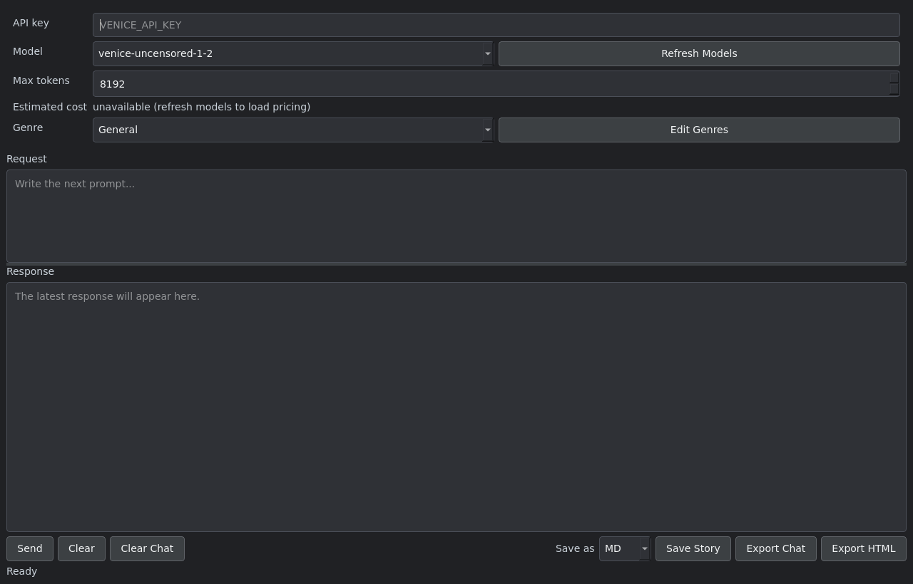
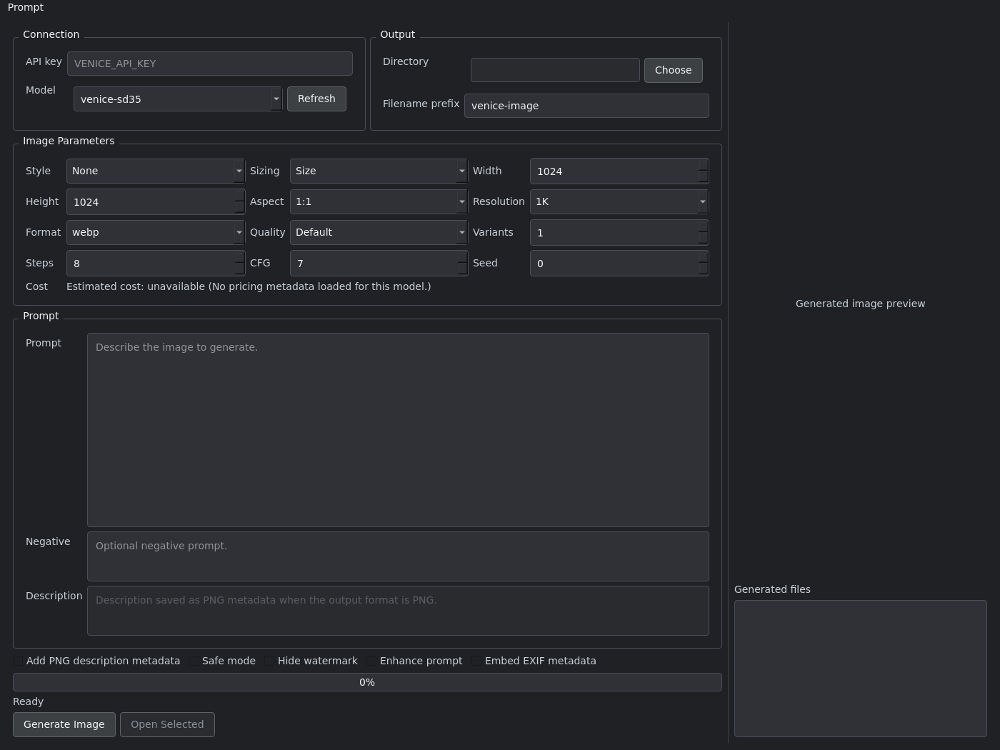
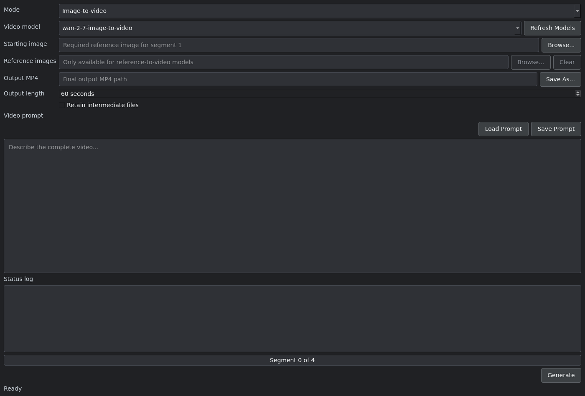
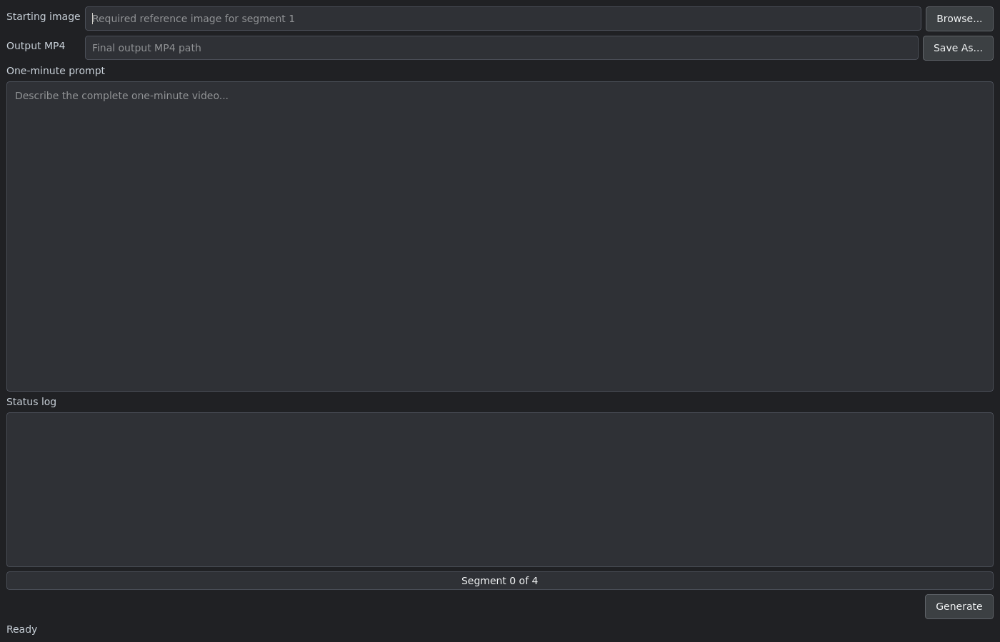
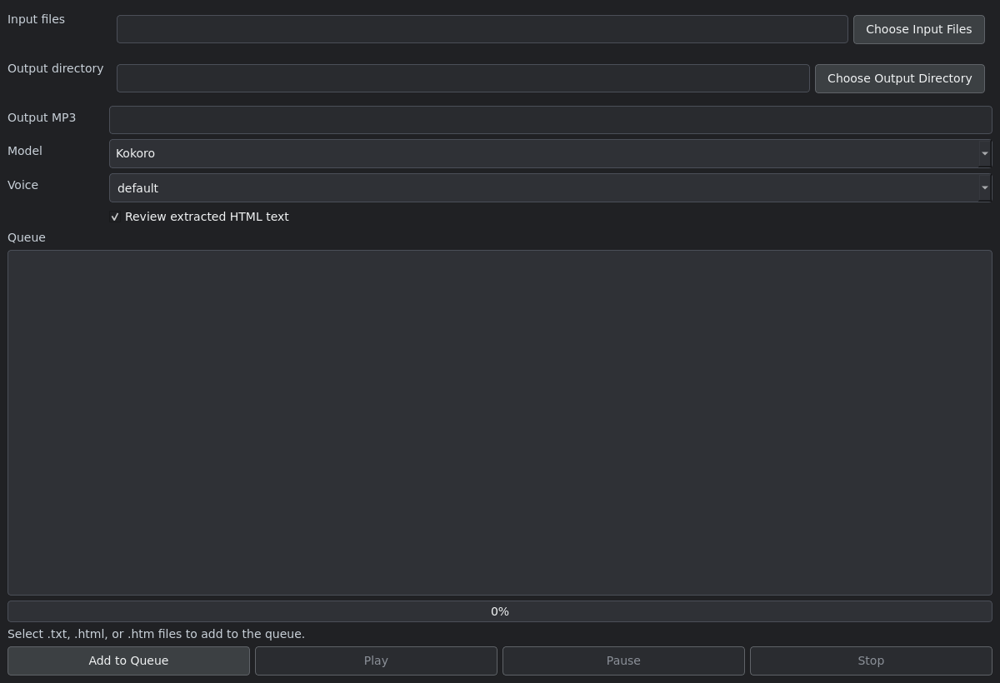

# Venice.ai Tools

Desktop tools and small Python utilities for creating text, images, video, and speech with the [Venice.ai API](https://venice.ai/).

The project is intended for prompt engineers who want a fast way to iterate on generations and for developers who want practical examples of Venice API integration, live model discovery, background requests, cost estimation, file export, and media post-processing.

The repository is available on GitHub at [muman613/venice.ai-tools](https://github.com/muman613/venice.ai-tools).

## Included tools

| Tool | Entry point | Purpose |
| --- | --- | --- |
| Story Writer | `venice-ai-story-writer.py` | Write and revise long-form Markdown with Venice chat models. |
| Image Generator | `venice-ai-image.py` | Generate image variants with model-aware dimensions, styles, and parameters. |
| Video Generator | `venice-ai-video.py` | Build variable-length image-to-video or text-to-video projects from sequential clips. |
| Classic Video Generator | `venice-ai-video-classic.py` | Build a fixed one-minute video from four Wan 2.7 image-to-video clips. |
| Text to Speech | `venice-ai-tts.py` | Queue TXT and HTML documents for conversion to MP3. |
| Model Listing Helper | `list-models.py` | Print model metadata matching Wan 2.7 from the Venice models endpoint. |

## Requirements

- Python 3.10 or newer
- A Venice.ai API key
- FFmpeg on `PATH` for either video generator
- A desktop environment capable of running PySide6 applications

Install FFmpeg on Ubuntu or Debian with:

```bash
sudo apt install ffmpeg
```

## Installation

Clone the repository, create a virtual environment, and install the Python packages:

```bash
git clone https://github.com/muman613/venice.ai-tools.git
cd venice.ai-tools
python3 -m venv .venv
source .venv/bin/activate
pip install -r requirements.txt
```

The Python dependencies are PySide6, Requests, ffmpeg-python, Markdown, and Beautiful Soup.

## API key configuration

Export the API key before starting a tool:

```bash
export VENICE_API_KEY="your-api-key"
```

This method works with every entry point. The Story Writer, Image Generator, and Text-to-Speech tool can also read `VENICE_API_KEY` from a local `.env` or `venice.env` file:

```dotenv
VENICE_API_KEY="your-api-key"
```

The video applications ask for a key at startup when `VENICE_API_KEY` is not present in the process environment. Keep local key files out of version control and never commit an API key.

## Story Writer



Start the application:

```bash
python venice-ai-story-writer.py
```

Use the Story Writer to develop prompts and produce long-form Markdown:

1. Choose a chat model. Select **Refresh Models** to retrieve the current uncensored text models and their pricing metadata from Venice.
2. Set **Max tokens** to limit the size of the response.
3. Choose a genre. Select **Edit Genres** to add, change, or delete reusable genre instructions.
4. Enter a request and select **Send**, or press `Ctrl+Enter`.
5. Revise the request and send it again to continue the in-memory conversation.
6. Save the latest response as TXT, Markdown, or HTML, or export the complete chat as Markdown.

The cost line estimates the next request's maximum USD cost from live model pricing. Input tokens are approximated locally and output cost is calculated from the selected maximum token count, so the actual cost may be lower.

The request remains in the editor after generation to make prompt iteration easier. **Clear** removes only the request text; **Clear Chat** removes the visible response and in-memory conversation history. Chat history is not saved automatically.

Custom genres are stored in a JSON file beside the application's platform settings file. Successful save and export locations are remembered between runs.

## Image Generator



Start the application:

```bash
python venice-ai-image.py
```

The application loads current image models and Venice style presets when an API key is available. To generate an image:

1. Select a model or enter a model ID. Use **Refresh** to reload models, pricing, and style presets.
2. Choose an output directory and filename prefix.
3. Enter the main prompt and, if needed, a negative prompt.
4. Select the sizing mode required by the model:
   - **Size** sends explicit width and height values.
   - **Aspect ratio** sends an aspect ratio such as `16:9` or `9:16`.
   - **Res + aspect** sends a resolution tier (`1K`, `2K`, or `4K`) and an aspect ratio.
5. Configure the output format, quality, number of variants, inference steps, CFG scale, and seed.
6. Optionally enable safe mode, watermark hiding, prompt enhancement, EXIF metadata, or a PNG description.
7. Select **Generate Image**.

The generated-file list can contain up to four variants. Select a file to preview it and inspect embedded metadata, or double-click it to open it with the system image viewer.

When pricing metadata is available, the tool estimates the total request cost for the selected model, size, quality, and variant count. Each completed request is appended to `venice-image-gen.log` in the output directory with its parameters, estimated cost, generated paths, and any enhanced prompt returned by Venice.

Use the **Prompt** menu to save a complete prompt configuration as JSON, save the prompt text as TXT, or load either format. Window layout, generation controls, and recently used directories are persisted between runs.

## Video Generator



Start the application:

```bash
python venice-ai-video.py
```

This is the recommended video workflow. It supports both **Image-to-video** and **Text-to-video** modes and discovers current video models from `/api/v1/models?type=video`.

### Image-to-video

1. Choose **Image-to-video** mode and refresh the model list.
2. Select a starting image. It supplies the first frame of the first segment.
3. For a reference-to-video model, optionally add ordered reference images. The interface enforces the model's advertised or known reference-image limit.
4. Choose the final MP4 path and requested output length.
5. Describe the complete video in the prompt editor.
6. Select **Generate**.

The application asks a Venice chat model to divide the complete prompt into timed segment prompts. It generates each clip in sequence, extracts the last frame, and supplies that frame as the source for the next clip. This helps preserve visual continuity across the final video.

### Text-to-video

1. Choose **Text-to-video** mode and select a compatible model.
2. Choose the final MP4 path and output length.
3. Enter the complete video prompt. A starting image is not used in this mode.
4. Select **Generate**.

For either mode, the requested duration must be expressible using durations supported by the selected model. The tool plans the smallest suitable set of segments, requests a quote for each segment when the quote endpoint is available, queues the jobs, polls them to completion, validates the returned media, and stitches the clips with FFmpeg.

Use **Load Prompt** and **Save Prompt** for TXT or Markdown prompt files. Enable **Retain intermediate files** to keep the generated segment MP4s, continuation-frame images, and segment-plan JSON. When the option is disabled, those artifacts are removed after the final MP4 has been validated. The retention choice, starting-image path, and prompt directory are remembered between runs.

Some Seedance requests require explicit face-processing consent. If Venice returns that requirement, the application displays the provider's explanation and asks before resubmitting the request with consent.

## Classic one-minute video generator



Start the classic workflow:

```bash
python venice-ai-video-classic.py
```

This legacy, model-specific workflow always creates a one-minute video as four sequential 15-second, 1080p Wan 2.7 image-to-video clips:

1. Select the starting reference image.
2. Choose the final MP4 path.
3. Describe the complete one-minute video.
4. Select **Generate**.

The prompt is divided into four segments. After each clip, FFmpeg extracts its final frame and uses it to start the next clip. The four results are then concatenated into the final MP4. Segment MP4s, continuation frames, and the generated segment JSON are written beside the selected output.

Use `venice-ai-video.py` for new projects that need live model selection, text-to-video support, variable duration, reference images, cost quotes, or optional intermediate-file cleanup. The classic tool remains useful for a predictable Wan 2.7 one-minute workflow.

## Text to Speech



Start the application:

```bash
python venice-ai-tts.py
```

Convert one or more `.txt`, `.html`, or `.htm` files to MP3:

1. Select **Choose Input Files** and pick one or more documents.
2. Choose an output directory.
3. Select either **Kokoro** or **ElevenLabs Turbo v2.5**.
4. Choose a voice. The ElevenLabs voice field is editable, so it also accepts a raw ElevenLabs voice ID.
5. Leave **Review extracted HTML text** enabled if you want to inspect and edit the visible text extracted from HTML before conversion.
6. Select **Add to Queue**.

Files are processed in order on a background thread. Long documents are split into request-sized chunks, converted, and combined into one MP3 per input file. The queue reports pending, running, completed, and failed items. Select a completed item and use **Play**, **Pause**, or **Stop** for local playback.

Diagnostics are written to `venice-ai-tts.log`. The selected model, voice, input location, and output directory are remembered between runs.

## Model listing helper

Run the command-line helper with an exported API key:

```bash
python list-models.py
```

Despite its general name, this script currently filters the models response and prints formatted JSON only for entries whose metadata matches Wan 2.7. It is useful for inspecting the live fields, constraints, and identifiers returned for those models.

To save the output for inspection:

```bash
python list-models.py > wan-2.7-models.json
```

## Optional environment variables

The defaults are suitable for most use, but long-running media jobs can be tuned through environment variables:

| Variable | Default | Used by |
| --- | ---: | --- |
| `VENICE_SEGMENT_MODEL` | `venice-uncensored-1-2` | Both video tools |
| `VENICE_IMAGE_VIDEO_MODEL` | `wan-2-7-image-to-video` | Main video tool |
| `VENICE_TEXT_VIDEO_MODEL` | `wan-2.5-preview-text-to-video` | Main video tool |
| `VENICE_VIDEO_TIMEOUT` | `1800` seconds | Both video tools |
| `VENICE_VIDEO_POLL_INTERVAL` | `5` seconds | Both video tools |
| `VENICE_VIDEO_MAX_HTTP_500_RETRIES` | `3` | Both video tools |
| `VENICE_FFMPEG_FRAME_TIMEOUT` | `120` seconds | Main video tool |
| `VENICE_FFMPEG_STITCH_TIMEOUT` | `900` seconds | Main video tool |
| `VENICE_SEEDANCE_CONSENT_TIMEOUT` | `900` seconds | Main video tool |
| `VENICE_TTS_TIMEOUT` | `180` seconds | Text to Speech |
| `VENICE_TTS_CHUNK_SIZE` | `1800` characters | Text to Speech |
| `VENICE_TTS_EDITOR` | system editor | HTML review editor |

Set overrides before launching an application, for example:

```bash
export VENICE_VIDEO_TIMEOUT=2400
export VENICE_TTS_CHUNK_SIZE=1500
python venice-ai-video.py
```

## Troubleshooting

- **The application cannot find the API key:** Export `VENICE_API_KEY` in the same terminal used to start the application. For the Story Writer, Image Generator, and TTS tool, a local `.env` or `venice.env` file is also supported.
- **Video generation reports that FFmpeg is missing:** Install FFmpeg and confirm that `ffmpeg -version` succeeds in the active terminal.
- **A requested video duration is rejected:** Choose a duration that can be composed from the selected model's supported clip lengths, or select another model.
- **Model or pricing data is unavailable:** Confirm network access and API credentials, then use the relevant **Refresh** button. The applications retain fallback model IDs where possible.
- **A long TTS request times out:** Increase `VENICE_TTS_TIMEOUT` or reduce `VENICE_TTS_CHUNK_SIZE` before starting the application.
- **A generated response ends early:** Increase **Max tokens** in the Story Writer or ask the model to continue.

API calls can incur Venice usage charges. Review the displayed estimates and current Venice pricing before starting large image batches or multi-segment video jobs.
